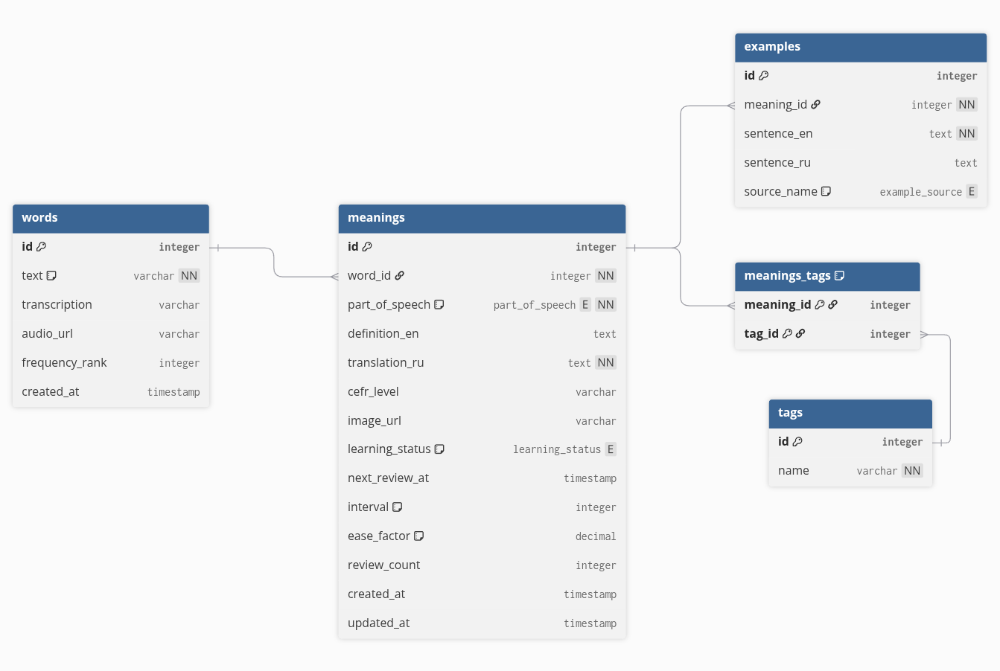

```
// Определение ENUM типов
Enum learning_status {
  new
  learning
  review
  mastered
}

Enum part_of_speech {
  noun
  verb
  adjective
  adverb
  other
}

Enum example_source {
  film
  book
  chat
  video
  podcast
}

// Таблицы
Table words {
  id integer [primary key, increment]
  text varchar [not null, unique, note: 'само слово (lowercase)']
  transcription varchar
  audio_url varchar
  frequency_rank integer
  created_at timestamp
}

Table meanings {
  id integer [primary key, increment]
  word_id integer [not null]
  
  // Лингвистика
  part_of_speech part_of_speech [not null]
  definition_en text
  translation_ru text [not null]
  cefr_level varchar
  image_url varchar
  
  // SRS (Интервальное повторение)
  learning_status learning_status [default: 'new']
  next_review_at timestamp
  interval integer [note: 'в днях']
  ease_factor decimal [default: 2.5]
  review_count integer
  
  created_at timestamp
  updated_at timestamp
}

Table examples {
  id integer [primary key, increment]
  meaning_id integer [not null]
  sentence_en text [not null]
  sentence_ru text
  source_name example_source
}

Table tags {
  id integer [primary key, increment]
  name varchar [unique, not null]
}

// Таблица связки Many-to-Many
Table meanings_tags {
  meaning_id integer [primary key]
  tag_id integer [primary key]
}

// Связи (Relations)
Ref: words.id < meanings.word_id [delete: cascade]
Ref: meanings.id < examples.meaning_id [delete: cascade]
Ref: meanings.id < meanings_tags.meaning_id [delete: cascade]
Ref: tags.id < meanings_tags.tag_id [delete: cascade]
```

